```{r setup, include=FALSE}
library(knitr)
library(xaringan)
# library(countdown)
options(htmltools.dir.version = FALSE)
opts_chunk$set(
  echo = FALSE, warning = FALSE, message = FALSE, comment = "#>",
  fig.path = "figure/", fig.align = "center", fig.height = 8.5,
  out.width = "100%", fig.show = "hold", fig.retina = 3,
  cache = TRUE, cache.path = "cache/"
)
```

```{r xaringan-themer, include=FALSE, warning=FALSE}
library(xaringanthemer)
style_duo(
  primary_color = "#d5d5d2",
  secondary_color = "#728C81",
  text_color = choose_dark_or_light(
    "#D1C7A8", darken_color("#D1C7A8", 0.9),
    lighten_color("#537165", 0.99)
  ),
  text_font_family = "Latin Modern Sans",
  text_font_size = "1.2rem",
  header_font_family = "Latin Modern Sans",
  code_font_google = google_font("Fira Mono"),
  header_h1_font_size = "1.8rem",
  header_h2_font_size = "1.7rem",
  colors = c(
    red = "#f34213",
    purple = "#3e2f5b",
    orange = "#c46303f8",
    green = "#136f63",
    white = "#FFFFFF",
    gray = "#c9c9c9",
    bermellon = "#ebdbb2",
    black = "#020202",
    charcoal = "#8393A8",
    brownish = "#A89883",
    greenish = "#84a396"
  )
)
```

class: center, title-slide, inverse-slide

<style>
.title-slide .remark-slide-number {
  display: none;
}

.title-slide h1 {
font-weight: bold;
font-size: 50px;
color: #282828;
}

.title-slide h2 {
font-weight: bold;
font-size: 40px;
color: #282828;
}

.subtitle-slide h1 {
  font-weight: bold;
  font-size: 40px;
}

.inverse-slide {
  background-color: #84a396;
  color: #020202;
}


.black-slide {
  background-color: #393533;
  color: #B58322;
}

</style>

<style>
.remark-slide-content {
  font-size: 28px;
}

</style>

<style>

.center2 {
  margin: -1%;
  position: absolute;
  top: 72%;
  left: 51%;
  width: 240px;
  height: 128px;
  -ms-transform: translate(-50%, -50%);
  transform: translate(-50%, -50%);
}

.logo {
  position: absolute;
  top: 1em;
  right: 1em;
  width: 110px;
  height: 128px;
  z-index: 0;
}

.my-one-page-font {
  font-size: 20px;
}

</style>

<style>
blockquote {
    background-color: #afc0d5;
    /* font face italic */
    font-style: italic;
}
</style>

<style>
div.footnotes {
  position: absolute;
  bottom: 0;
  margin-bottom: 10px;
  width: 80%;
  font-size: 0.6em;
}
</style>

# Inteligencia artificial para la segmentación automática de la conducta
# Emmanuel Alcalá
## CEIC, Universidad de Guadalajara

.center2[
```{r echo = FALSE}

```
]

---
class: middle

Esta charla está dividida en dos partes:

--

* En la segunda parte hablaré un poco sobre mi trabajo.

--

- En la primera, quiero convencerlos de lo siguiente:

--

La psicología básica es importante. 

--

.center[
  .content-box[
      *Muy importante*.
  ]
]

--

¿Listos?

--

Dejaré lo más aburrido para el final.

---
class: middle

```{r, echo=FALSE, fig.align='center', out.width='60%'}

```

---
class: middle black-slide

# Primera parte

---
class: middle inverse

.strong[
  ¿Qué pensamos cuando escuchamos el término "Inteligencia Artificial"?
]

--

- Probablemente solo en su rama aplicada:

--

.pull-left[
```{r self_driving, out.width='67%', fig.cap='Self-driving'}

```

]

--

.pull-right[

```{r art, out.width='110%', fig.cap='DALL-E'}
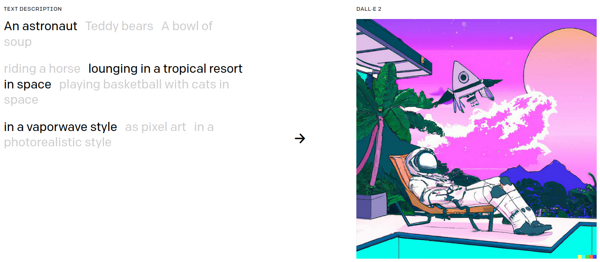
```
]

---
class: middle inverse

.strong[
  ¿Qué pensamos cuando escuchamos el término "Inteligencia Artificial"?
]

- O en el futuro post-apocalíptico de Terminator (si tienen más de 30 años)...

```{r ia-risk, out.width='60%', fig.cap='La supremacía de la IA'}

```

---
class: middle inverse

- La IA tiene también una vertiente más científica: modelar, y en ese sentido entender, la cognición y la conducta.

--

- Aunque no es tan conocido, esa vertiente ha sido influida por la psicología y las neurociencias, especialmente la que investiga la percepción y el aprendizaje.

--

- Hay dos sentidos en esta relación. Hablaré del primero en la primera parte de la charla. En la segunda parte hablaré del segundo.

---
class: middle inverse

```{r, echo=FALSE, fig.align='center', out.width='60%'}
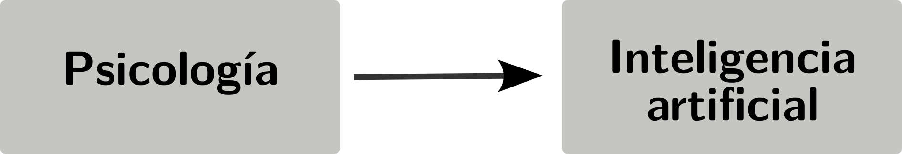
```

--

La IA nació como una herramienta teórica para probar ciertos conceptos imperantes en los en las décadas de los 40s - 70s.

--

- La idea de que las capacidades psicológicas (léase *cognición*) puede ser entendida como una forma de *computación* (i.e., como máquinas de Turing).

--

- La idea de que las capacidades psicológicas puede ser entendidas como un *proceso de aprendizaje*, es decir, el resultado de nuestra *experiencia*.

--

.content-box[La idea era crear ~~máquinas~~ que implementaran y fueran consistentes con esos conceptos, y explorar sus capacidades y limitaciones.]


---
class: middle

## ¿Qué es la IA?

- Una definición muy general de la IA es como el estudio de agentes que perciben su entorno y ejecutan acciones para alcanzar un objetivo.

--

- Uno de sus objetivos es la creación de máquinas o algoritmos cuyo comportamiento (y solo su comportamiento) sea indistinguible del de organismos inteligentes.

--

- Es natural plantearse la idea de que, para ese objetivo, se debería investigar primero a los agentes cuya inteligencia se quiere emular.

--

- ¿Investigar qué?

---
class: middle

## La importancia del aprendizaje

--

>Nada tiene sentido en psicología si no es a través del aprendizaje.

--

- Actualmente, el paradigma dominante de la IA es basado en aprendizaje.

--

- Ejemplo: ¿cuántas *reglas* necesitaríamos para saber si debemos cruzar la calle? 

--

- Hay semáforos, temporizadores, señales de tránsito, coches en movimiento en una u otra dirección, convenciones sociales sobre el respeto a las reglas, etc.

---
class: middle

- El aprendizaje resuelve un problema importante. Si naciéramos con habilidades fijas e inmutables, no podríamos hacer frente a un mundo cambiante.

--

- Nos permite adaptarnos a situaciones impredecibles:

--
  -	 En el tiempo (cuándo va a llover)
--

  -  En el lugar (en dónde va a llover)
--

  -  En relación a otros eventos (¿qué tan probable es que llueva *si* está nublado?)

---
class: middle

## ¿Cómo lo hacemos?

--

La respuesta a esa pregunta es una de las más importantes en psicología, y la que más ha influido en la IA.

Requiere saber dos cosas:

--

* El mecanismo
* El sustrato biológico

--

- Investigaciones como las de Pavlov y Skinner llevaron a muchos a preguntarse lo siguiente:

--

 * ¿Qué ocurre biológicamente cuando un animal experimenta algo, y la siguiente vez que lo experimenta responde diferente?

---
class: middle

- Algo tenía que *preservar* esa experiencia.

--

>«Cualquier par de células o sistemas de células que estén repetidamente activos al mismo tiempo tenderán a "asociarse" de modo que la actividad en una facilite la actividad en la otra.» -- Hebb (1949)

---
class: middle

## Modelando el aprendizaje

--

El *insight* de Hebb fue revolucionario: resumió resultados empíricos en un *principio* formalizado matemáticamente.

--

Paralelamente, la investigación en aprendizaje animal seguía progresando.

--

Se resumía en la idea de que los animales podían aprender estructura ricas de información de su entorno, y escoger las acciones que maximizaban su recompensa.

--

Esto dio lugar a un área de investigación llamada *aprendizaje por refuerzo* en ciencias de la computación.

--

Uno de los primeros modelos de aprendizaje por refuerzo fue el *Q-learning*:

$$Q(s_t,a_t) \leftarrow Q(s_t,a_t) + \alpha \left[ r_{t+1} + \gamma \max_a Q(s_{t+1},a) - Q(s_t,a_t) \right]$$

---
class: middle

El conexionismo (ahora DL) y el aprendizaje por refuerzo son dos de los paradigmas más importantes en la IA actual.

--

LITERALMENTE, la IA moderna es una combinación de ambos.

--

Estamos hablando de industrias del orden de los billones de dólares (iuc, pero sí).

--

Sus fundamentos son *psicológicos*: cómo aprendemos y cómo tomamos decisiones.

---
class: middle

# ¿Quiénes fueron los pioneros de estos paradigmas?

---
class: middle

**Geoffrey Hinton**

```{r, echo=FALSE, fig.align='center', out.width='30%'}
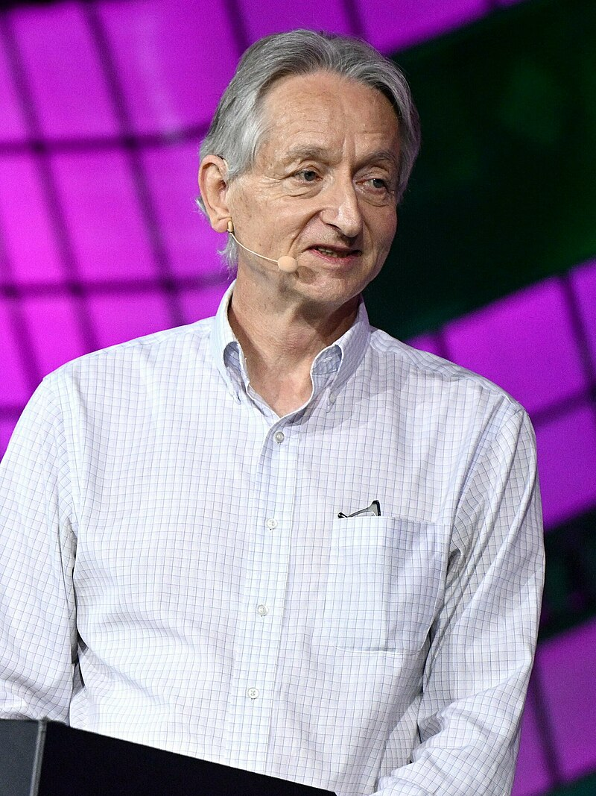
```
--

.center[¿Profesión?]

--

.center[Psicólogo]

---
class: middle

**David Rumelhart**

```{r, echo=FALSE, fig.align='center', out.width='30%'}
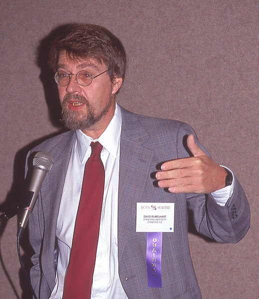
```

.center[¿Profesión?]

--

.center[Psicólogo]

---
class: middle

**James McClelland**

```{r, echo=FALSE, fig.align='center', out.width='28%'}
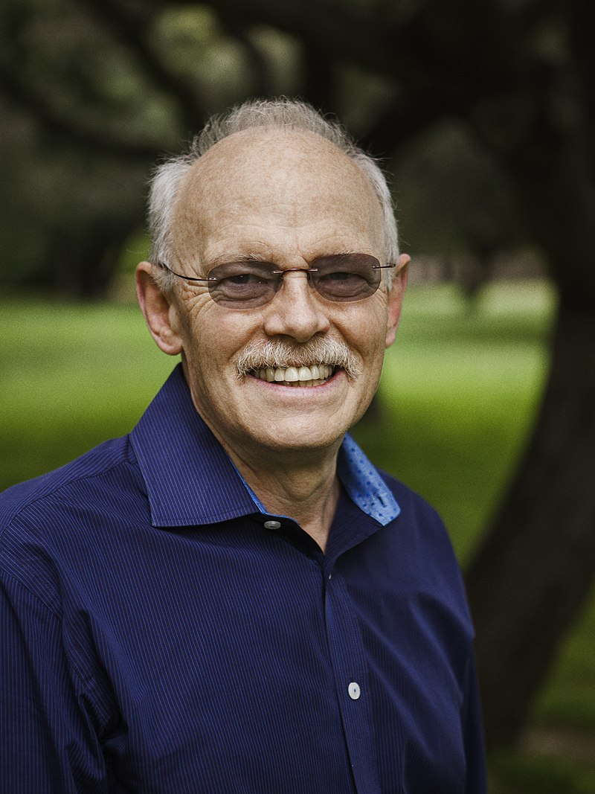
```

.center[¿Profesión?]

--

.center[Psicólogo]

---
class: middle

**Richard Sutton**

```{r, echo=FALSE, fig.align='center', out.width='75%'}
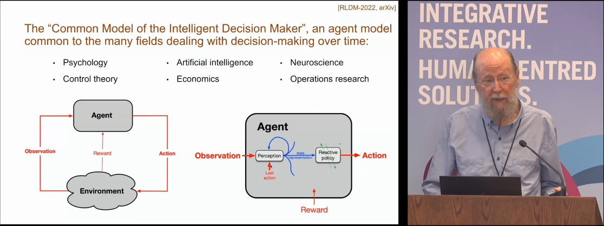
```

.center[¿Profesión?]

--

.center[Psicólogo]

---
class: middle

**Robert Rescorla y Alan Wagner**

```{r, echo=FALSE, fig.align='center', out.width='70%'}
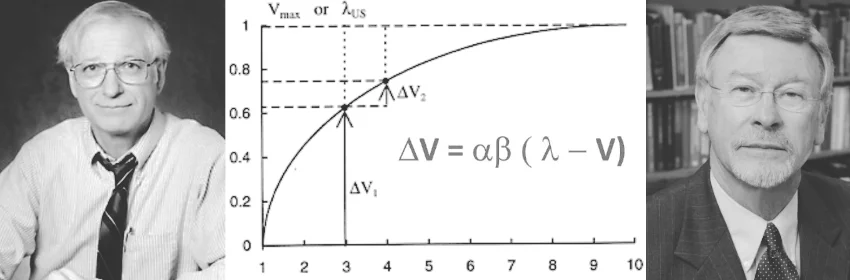
```

.center[¿Profesión?]

--

.center[Psicólogos]

---
class: middle black-slide

# Segunda parte

---
class: middle inverse

```{r, echo=FALSE, fig.align='center', out.width='60%'}
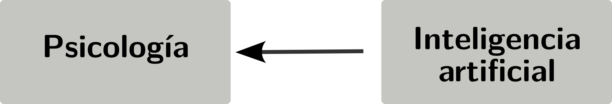
```
--

Una vez que la IA llegó a cierto grado de madurez, comenzaron a surgir muchas aplicaciones en ingeniería. 

--

Podíamos construir algoritmos eficientes que aprendían a hacer tareas complejas, como reconocer objetos en imágenes, clasificar objetos o secuencias por similitud, predecir, memorizar, etc.

---
class: middle

# ¿Qué se puede hacer en psicología con esos algoritmos?

--

Por ejemplo, podemos usarlos para modelar el comportamiento de organismos *como si* siguieran las reglas de esos algoritmos.

--

También, podemos usarlos para descubrir patrones en datos de comportamiento.

--

Eso es lo que mostraré aquí.

---
class: middle

# Segmentación automática de la conducta

El estudio del aprendizaje y el comportamiento comenzó en *espacio* (por ejemplo, laberintos, campo abierto, etc.).

--

Medir el comportamiento de forma continua en el espacio aumenta el número de dimensiones, lo cual ha sido un problema técnico desde hace mucho tiempo.

--

Acá uso una clase de algoritmos de aprendizaje llamados modelos *no supervisados*. Estos modelos se utilizan para descubrir patrones en los datos sin la necesidad de etiquetas predefinidas.

--

Específicamente, uso DL para extraer características de los datos, y un modelo de Markov oculto para segmentar los datos en estados conductuales.

---
class: middle

```{r, echo=FALSE, fig.align='center', out.width='60%'}
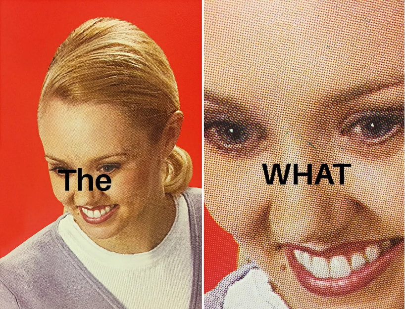
```


---
class: middle

TL;DR

--

* Uso un algoritmo de DL para extraer las características más importantes de los datos de movimiento de ratones.

* Esas características son usadas como entrada a otro modelo que te dice si un grupo de características en un momento dado fue *generado* por un estado conductual o por otro.

---
class: middle

## Flujo de trabajo

```{r, echo=FALSE, fig.align='center', out.width='80%'}
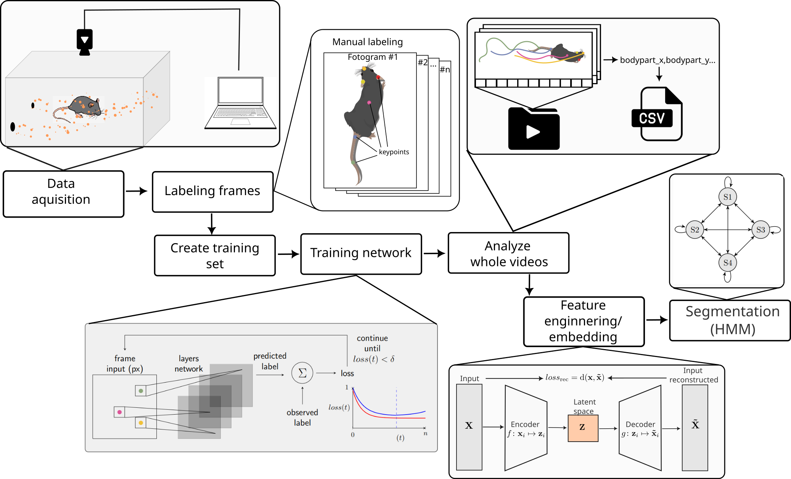
```
---
class: middle

## Datos

Los datos provienen de videos de ratones expuestos a Ciclohexano y ratones no expuestos, y se obtuvieron utilizando DeepLabCut (Mathis et al, 2018).

```{r, echo=FALSE, fig.align='center', out.width='50%'}
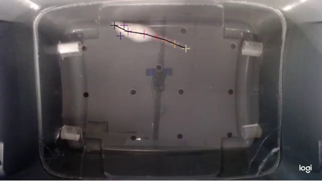
```
---
class: middle

Ejemplo de reconstrucción de la trayectoria de un ratón utilizando poses estimadas con DLC.

```{r, echo=FALSE, fig.align='center', out.width='70%'}
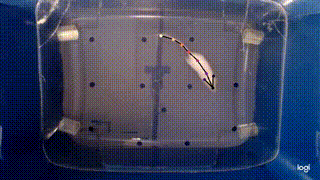
```

---
class: middle

## Incrustación utilizando un autocodificador variacional

--

Un autocodificador variacional (VAE) es un modelo generativo que aprende un espacio latente $\mathbf{Z}$, una representación de baja dimensionalidad de los datos que captura las características más importantes, a partir de $\mathbf{X}$.

```{r, echo=FALSE, fig.align='center', out.width='65%'}
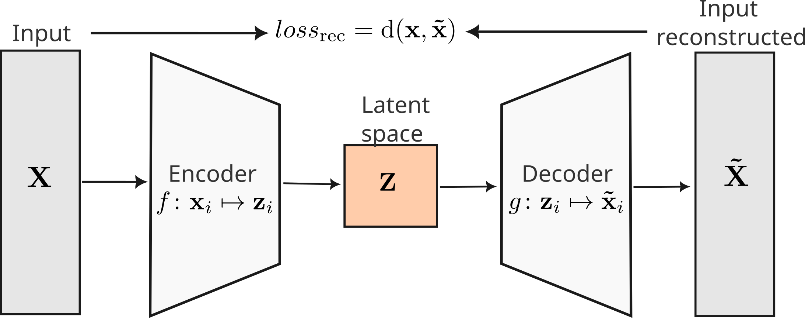
```

---
class: middle

## HMM

--


Un modelo oculto de Markov es un modelo generativo que asume que los datos son generados por un proceso de Markov con estados ocultos. Los estados ocultos no son directamente observables, pero los datos sí lo son. Se asume que los estados ocultos siguen un proceso de Markov, es decir, la probabilidad de estar en un estado en el tiempo $t$ depende solo del estado en el tiempo $t-1$.

---
class: middle

Utilizando el espacio latente del VAE como entrada para el HMM, pudimos identificar varios estados, dos de los cuales incluían el comportamiento de girar en círculos.

---
class: middle

<div style="display: flex;">
  <div style="flex: 3;">
    <video width="90%" height="90%" controls id="my_video">
      <source src="img/umap_states_vame_first.mp4" type="video/mp4">
    </video>
  </div>
  <div style="flex: 1; text-align: center;">
    <p>Minuto 2</p>
  </div>
</div>

<div style="display: flex;">
  <div style="flex: 3;">
    <video width="90%" height="90%" controls id="my_video">
      <source src="img/umap_states_vame_circling.mp4" type="video/mp4">
    </video>
  </div>
  <div style="flex: 1; text-align: center;">
    <p>Minuto 17</p>
  </div>
</div>

---
class: middle

## ¿Qué sigue?

--

* Explorar otros modelos.
* Explorar otras conductas (e.g., ¿puede capturar estereotipias en, por ejemplo, TEA?)
* Validar el modelo y los estados con observadores entrenados.

--

Pero más importante:

--

No morir de hambre. 

---
class: middle

.center[
  # Gracias
.content-box[jealcalat@gmail.com]
]
